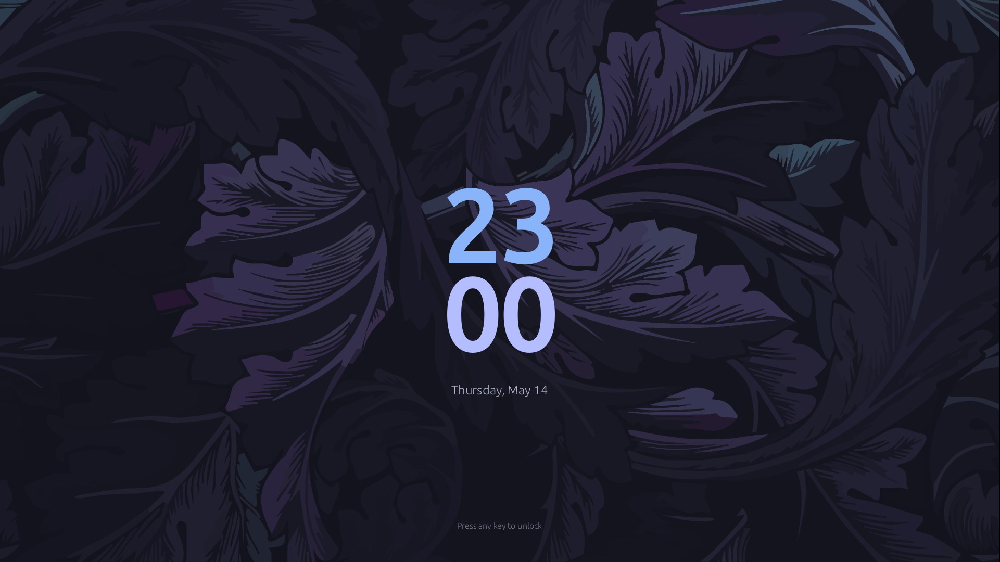
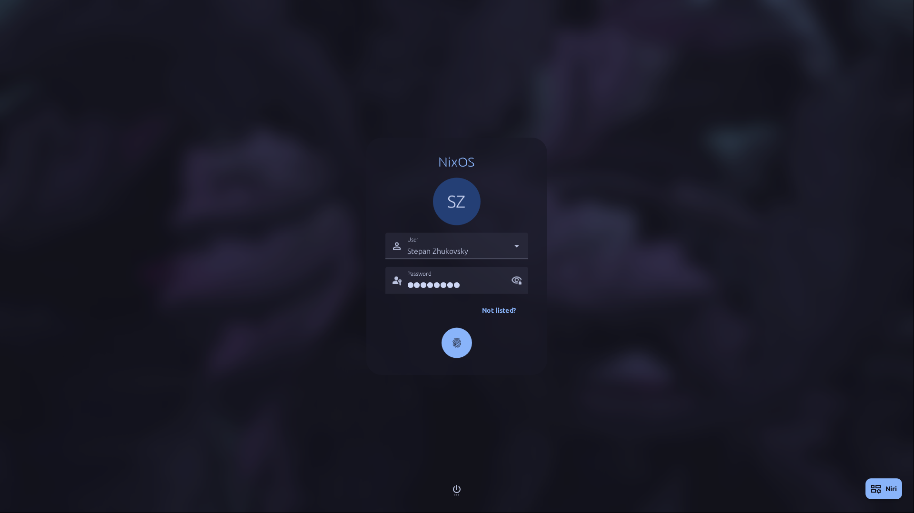
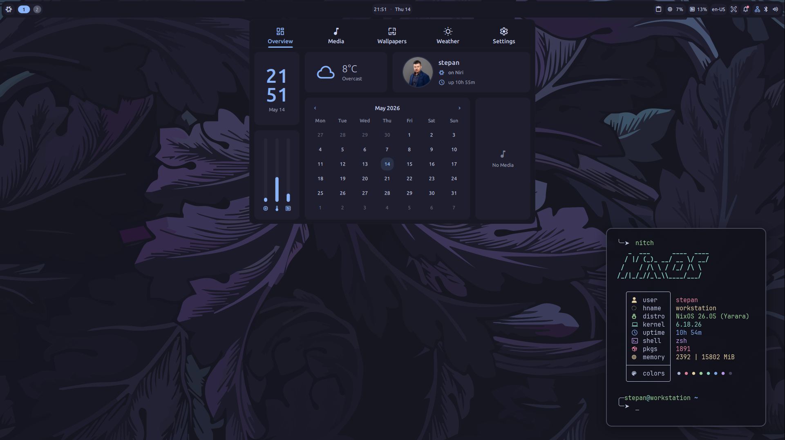

# nixos-configurations

**Personal NixOS and Home Manager configurations for my devices, highly
modular and themed with Catppuccin Mocha.**

This repository contains my declarative configuration for laptops,
workstations, and servers. Built on NixOS Unstable with a focus on
Wayland, modern CLI tools, and a unified aesthetic powered by Matugen.

 

## Key Features

- **Nix Flakes:** Pure, reproducible configurations for all devices.
- **Wayland Native:** Centered around the **Niri** scrollable tiling compositor.
- **Modern Login:** Lightweight **greetd** paired with a custom Material Design
  greeter — [mdgreet](https://github.com/MOIS3Y/mdgreet).
- **Dank Material Shell:** A polished desktop shell with a "fresh look" based
  on Material Design 3. Comes with "batteries included" and strikes a perfect
  balance between declarative configuration and imperative flexibility.
- **Dynamic Theming:** Unified Catppuccin Mocha aesthetic powered by
  [matugen-nix](https://github.com/MOIS3Y/matugen-nix).
- **Modular Architecture:** Separation between hardware-specific settings,
  shared system logic, and user-level Home Manager configurations.
- **Secure Secrets:** Fully encrypted sensitive data using sops-nix and age.

## Installation & Usage

Comprehensive guides on installation, architecture, and theming are available
in the official **[Documentation](https://mois3y.github.io/nixos-configurations/)**.

## Tech Stack

- **OS**: [NixOS Unstable](https://nixos.org)
- **Display Manager**: greetd + [mdgreet](https://github.com/MOIS3Y/mdgreet)
- **Compositor**: [Niri](https://github.com/niri-wm/niri)
- **Desktop Shell**: [DMS](https://github.com/AvengeMedia/DankMaterialShell)
- **Shell**: Zsh
- **Terminals**: Kitty, Alacritty
- **Theming**: [Catppuccin Mocha](https://catppuccin.com)
- **Secrets**: [sops-nix](https://github.com/Mic92/sops-nix)
- **Editors**: [Neovim (NvChad)](https://github.com/nix-community/nix4nvchad), Zed, VS Code
- **Gaming**: Steam, Bottles, GameScope

## License

This project is licensed under the **MIT** License. See the [LICENSE](./LICENSE)
file for details.

---

  Made with ❤️ by MOIS3Y

